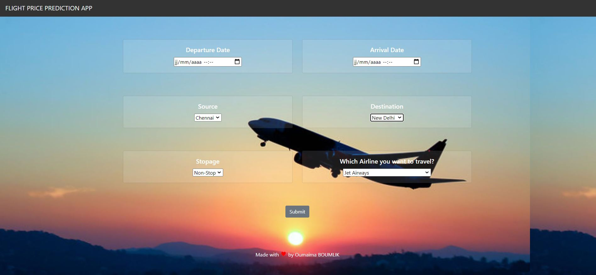

# Flight Price Prediction: 

## Description:
This is a Flask web app which predicts the price of Flight tickets.
(EDA, Hyper param Tuning, Time Series Analysis, Flask, Heroku)

## Demo:

Link: [https://price-flight.herokuapp.com/predict](https://price-flight.herokuapp.com/predict)

## Data:

[Kaggle Datasets](https://www.kaggle.com/nikhilmittal/flight-fare-prediction-mh/)

## How to run the App?

1. Install all the libraries mentioned in the requirements.txt file.
2. Clone this repository in your local system.
4. Open the command prompt from your project directory and run the command `python app.py`.

## Contact ME :)

[linkedin](https://www.linkedin.com/in/oumaima-boumlik-732066159/?locale=en_US)    

[Medium](https://medium.com/@boumlikoumaima)
